### Subnets

### 7 Network

### 27 Network

### Vlan-1

### Vlan-2

### Spaces

### Network services

### Package repositories

### General settings

#### MAAS Configuration
* MAAS name: noden18
* Enable Google Analytics clicked

#### Commissioning
* Ubuntu 18.04 LTS "Bionic Beaver"
* No minimum kernel

#### Deploy
* Ubuntu
* Default OS: Ubuntu 18.04 LTS "Bionic Beaver"

#### Third Party Drivers Configuration
* Enable the installtion of proprietary drivers clicked

### noden29

### noden20

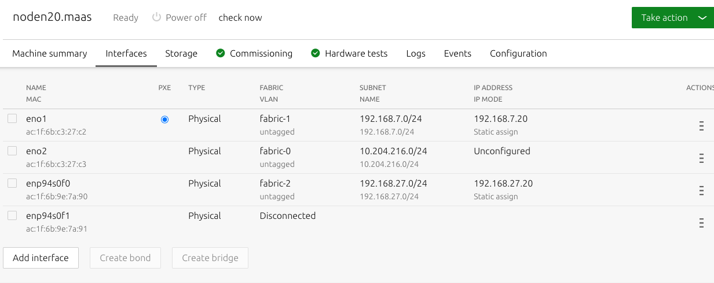
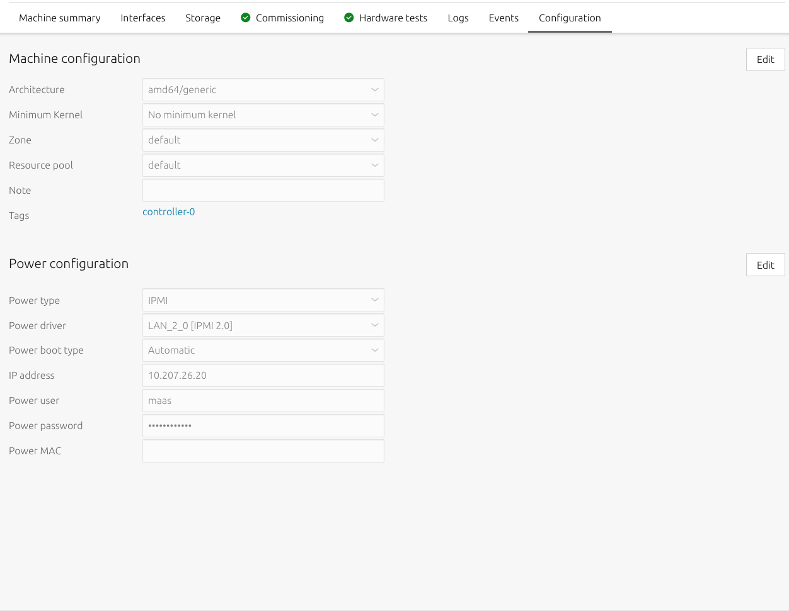

### noden19

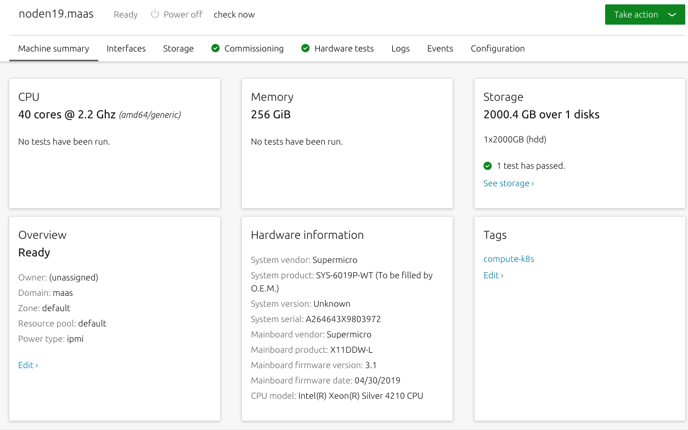
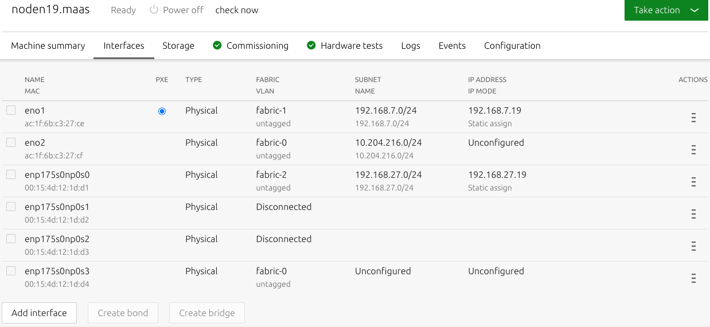
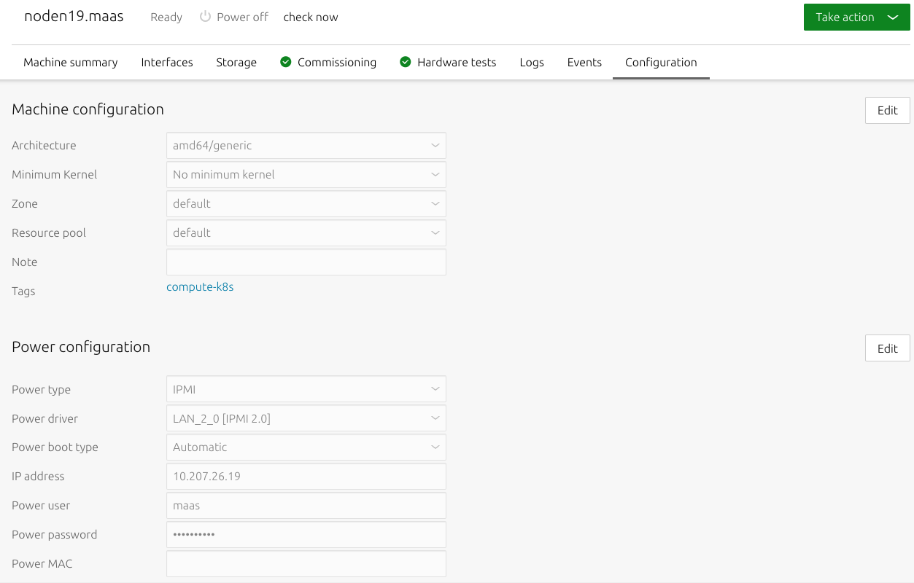

### nodec9

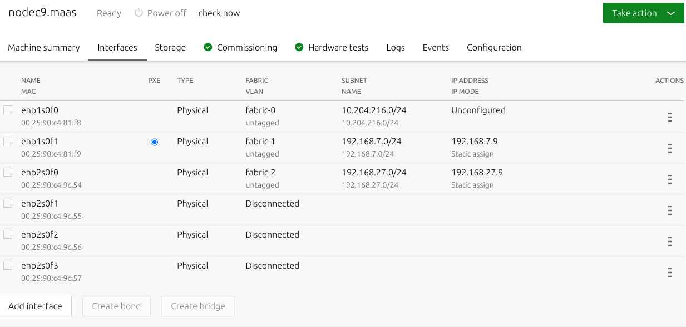
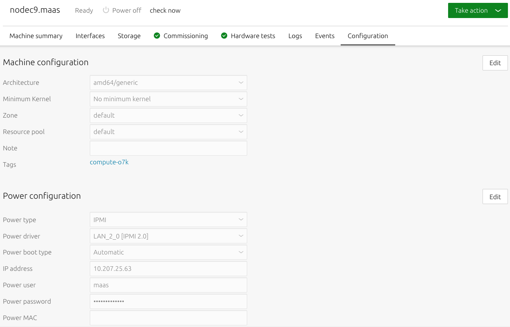

### nodei34

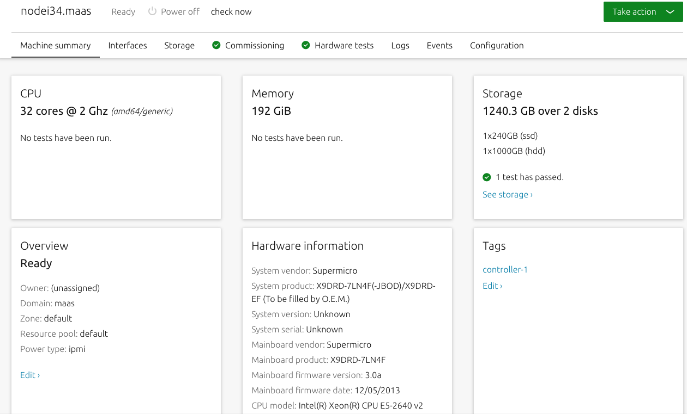
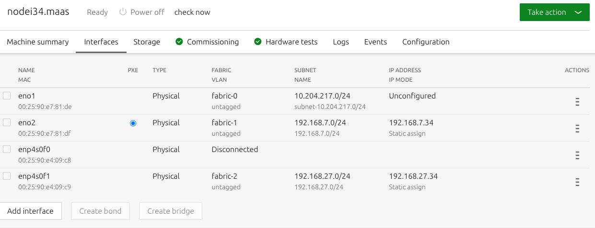

### juju
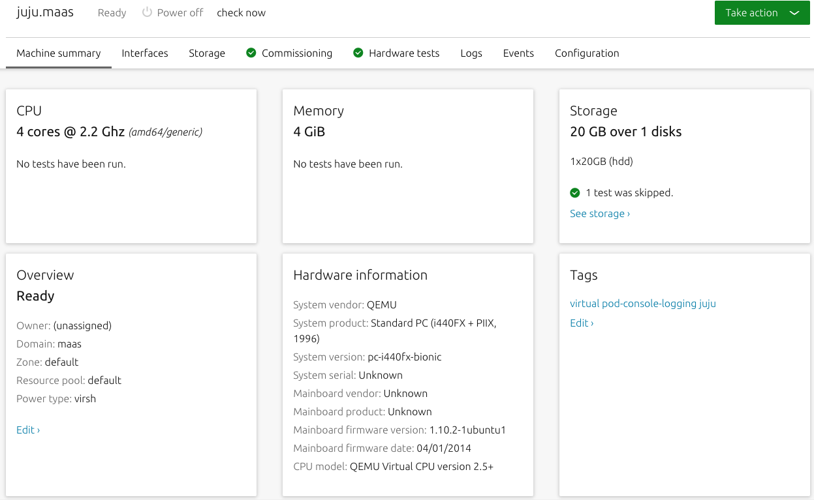
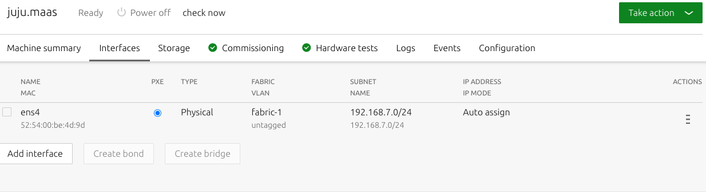
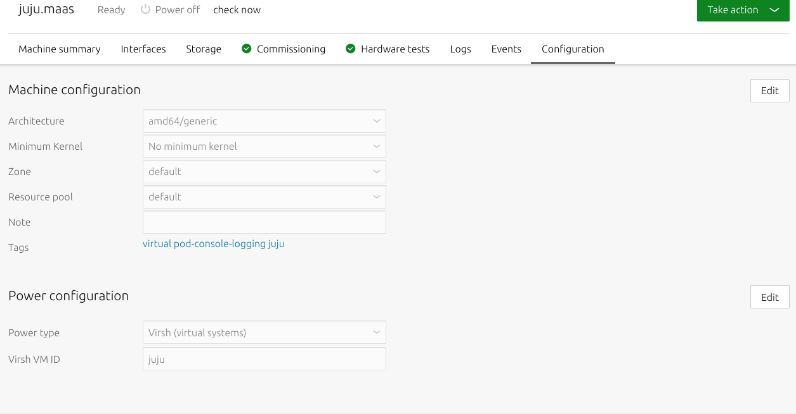

### neutron

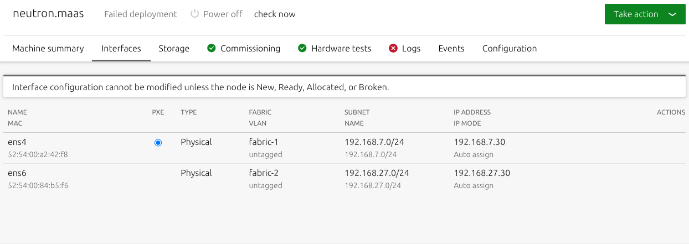

### g20
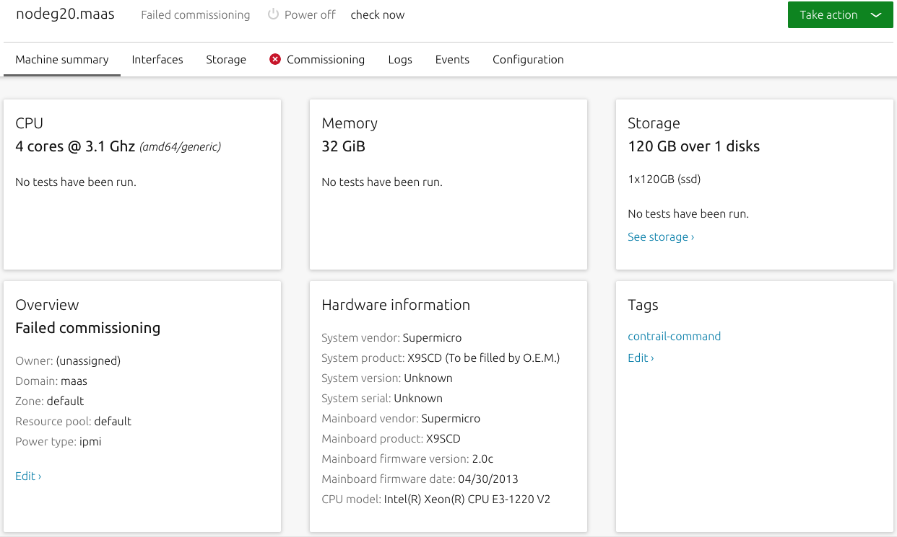
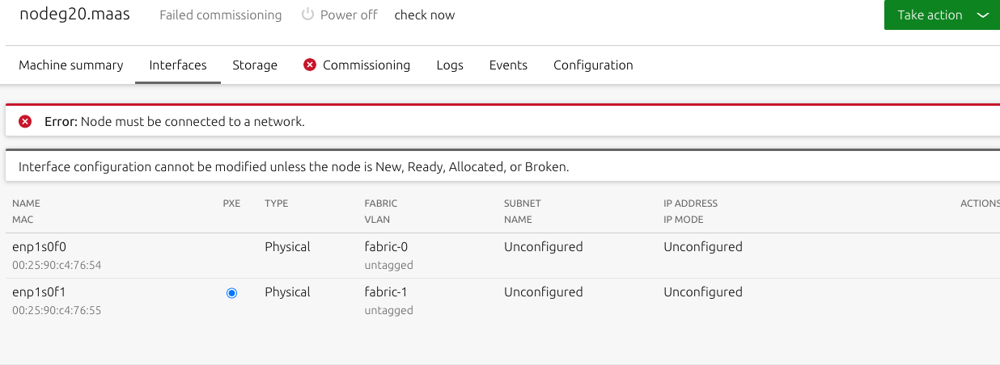